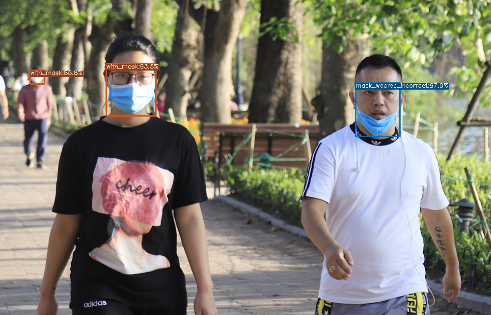

# Face Mask Detection with DAMO-YOLO

This repo simply uses DAMO-YOLO to detect people wearing masks, not wearing them, or wearing masks improperly (3 classes)



<sub>Source image: Google</sub>

## Environments and Dependencies

- ~~Python 3.10.6~~ (I try this but cannot install older version of `numpy`)
- Python 3.8.16

Get DAMO-YOLO and other repo

``` bash
git submodule update --init
git submodule update --recursive --remote
git pull --recurse-submodules
```

Install requirements

``` bash
# Upgrade pip
pip install --upgrade pip
# Install torch and torchvision (torchvision higher version trigger `affine() got an unexpected keyword argument 'resample'`)
pip install torch==1.11.0+cu113 torchvision==0.12.0+cu113 --find-links https://download.pytorch.org/whl/torch_stable.html
# Install required libraries
pip install pyproject.toml # To install numpy==1.19.5
pip install -r requirements.txt
# Install damo-yolo
pip install -e DAMO-YOLO
# Install [pycocotools](https://github.com/cocodataset/cocoapi)
pip install cython
pip install git+https://github.com/cocodataset/cocoapi.git#subdirectory=PythonAPI # for Linux
#pip install git+https://github.com/philferriere/cocoapi.git#subdirectory=PythonAPI # for Windows
```


## Data

You can find this dataset from [Kaggle](https://www.kaggle.com/datasets/andrewmvd/face-mask-detection)

## Prepare

Follow [tutorial](https://github.com/tinyvision/DAMO-YOLO/blob/master/assets/CustomDatasetTutorial.md#tutorial-for-finetuning-on-a-custom-dataset) on custom dataset of DAMO-YOLO

### Split train test

Simply run

``` bash
python split_data.py
```

### Preprocess Label Format

Convert PASCAL VOC label format to COCO label format

In this repo, I use [yukkyo/voc2coco](https://github.com/yukkyo/voc2coco) repo as base and add some code to convert

Follow [instruction](https://github.com/yukkyo/voc2coco#how-to-use) from yukkyo's repo and you will get your label file in COCO label format

Sample run

``` bash
# Show label
grep -REoh '<name>.*</name>' ./data/annotations | sort | uniq

# Get label.txt
grep -ERoh '<name>(.*)</name>' ./data/annotations | sort | uniq | sed 's/<name>//g' | sed 's/<\/name>//g' > ./data/labels.txt

# Get path.txt for train and valid
ls -d ./data/annotations/* > ./data/paths.txt
python split_data.py

# Convert voc2coco
python voc2coco/voc2coco.py \
    --ann_paths_list ./data/train_paths.txt \
    --labels ./data/labels.txt \
    --output ./data/coco_annotations/face_mask_train.json \
    --extract_num_from_imgid \
    --ext xml

python voc2coco/voc2coco.py \
    --ann_paths_list ./data/valid_paths.txt \
    --labels ./data/labels.txt \
    --output ./data/coco_annotations/face_mask_valid.json \
    --extract_num_from_imgid \
    --ext xml
```

### Link custom dataset into DAMO-YOLO

- Link custom dataset into `./DAMO-YOLO/datasets`

``` bash
ln -s ./data DAMO-YOLO/datasets/face_mask
```

### Download pretrained weights

Download pretrained weights from [Model Zoo](https://github.com/tinyvision/DAMO-YOLO#model-zoo) of DAMO-YOLO

### Modify config file

#### Base config

In `./config/base.py`, modify any config you want to change, for example:

``` python
miscs = easydict({
    'print_interval_iters': 50,    # print interval
    'output_dir': '../workdirs',    # save dir
    'exp_name': os.path.split(os.path.realpath(__file__))[1].split('.')[0],
    'seed': 1234,                  # rand seed for initialize
    'eval_interval_epochs': 10,    # evaluation interval
    'ckpt_interval_epochs': 10,    # ckpt saving interval
    'num_workers': 4,
})
```

#### Config for data

Add the custom dataset into `./config/paths_catalog.py`. Note, the added dataset should contain **coco** in their names to declare the dataset format, e.g., here we use `coco_face_mask_train` and `coco_face_mask_valid`

``` python
'coco_face_mask_train': {
    'img_dir': '../data/images',
    'ann_file': './data/coco_annotations/face_mask_train.json' 
},
'coco_face_mask_valid': {
    'img_dir': '../data/images',
    'ann_file': '../data/coco_annotations/face_mask_valid.json'
},
```

#### Config for training

In this project, I use DAMO-YOLO-Tiny

- Download DAMO-YOLO-Tiny torch model from [Model Zoo](https://github.com/tinyvision/DAMO-YOLO#model-zoo)

- Add (if not exist) or modify (if exist) the following pretrained model path into `./config/damoyolo_tinynasL20_T.py`

``` python
self.train.finetune_path='../weights/'
```

- Modify the custom dataset in config file. 

``` python
self.dataset.train_ann = ('coco_face_mask_train', )
self.dataset.val_ann = ('coco_face_mask_valid', )
```

- Modify `batch_size` and something else

``` python
self.train.batch_size = 64
```

- Modify the class name in config file

``` python
self.dataset.class_names = ['mask_weared_incorrect', 'with_mask', 'without_mask']
```

#### Move configs

Copy configs to specific folders `./DAMO-YOLO/`

``` bash
cp ./config/base.py ./DAMO-YOLO/damo/config/
cp ./config/paths_catalog.py ./DAMO-YOLO/damo/config/
cp ./config/damoyolo_tinynasL20_T.py ./DAMO-YOLO/configs/
```

I have included these scripts in `train.sh`


## Train

Training from DAMO-YOLO pretrained weights

``` bash
bash train.sh
```

## Eval

If you want to evaluate model, simply run

``` bash
bash eval.sh
```

## Experiment results

With 300 epochs

| Models | AP | AP50 | AP75 | APs | APm | APl | Size |
|:---:|:---:|:---:|:---:|:---:|:---:|:---:|:---:|
| [DAMO-YOLO-T](https://drive.google.com/file/d/1rV-jQZlBK_u-2MYXPS2-ocnIu4iEBKt8/view?usp=share_link) | 0.663 | 0.925 | 0.842 | 0.624 | 0.693 | 0.835 | 65.76MB |

## Detect

You can download pretrained model, modify path to model in `test.sh` and run

``` bash
bash test.sh
```

## Reference

- [Face Mask Detection Dataset](https://www.kaggle.com/datasets/andrewmvd/face-mask-detection?resource=download)
- [tinyvision/DAMO-YOLO](https://github.com/tinyvision/DAMO-YOLO)
- [yukkyo/voc2coco](https://github.com/yukkyo/voc2coco)

## Cite

```latex
@misc{make ml,
  title={Mask Dataset},
  url={https://makeml.app/datasets/mask},
  journal={Make ML}
}

@article{damoyolo,
  title={DAMO-YOLO: A Report on Real-Time Object Detection Design},
  author={Xianzhe Xu, Yiqi Jiang, Weihua Chen, Yilun Huang, Yuan Zhang and Xiuyu Sun},
  journal={arXiv preprint arXiv:2211.15444v2},
  year={2022},
}

@inproceedings{sun2022mae,
  title={Mae-det: Revisiting maximum entropy principle in zero-shot nas for efficient object detection},
  author={Sun, Zhenhong and Lin, Ming and Sun, Xiuyu and Tan, Zhiyu and Li, Hao and Jin, Rong},
  booktitle={International Conference on Machine Learning},
  pages={20810--20826},
  year={2022},
  organization={PMLR}
}

@inproceedings{tan2021giraffedet,
title={Giraffedet: A heavy-neck paradigm for object detection},
  author={Tan, Zhiyu and Wang, Junyan and Sun, Xiuyu and Lin, Ming and Li, Hao and others},
  booktitle={International Conference on Learning Representations},
  year={2021}
}
```
